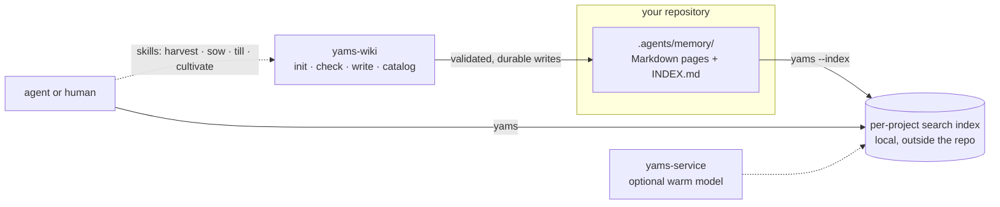

<h1 align="center">🍠 Yams</h1>

<p align="center"><em>Yet Another Memory System</em></p>

<p align="center">
  <strong>Offline memory search for coding agents.</strong><br/>
  Your project's knowledge lives as Markdown in your repo.
  Yams makes it searchable by meaning, not just keywords:
  fast, local, and never phoning home.
</p>

<p align="center">
  <a href="https://github.com/PonchoPig/yams/releases"></a>
  <a href="https://github.com/PonchoPig/yams/actions/workflows/ci.yml"></a>
  <a href="#license"></a>
  
</p>

<p align="center">
  <a href="#quick-start">Quick start</a> &bull;
  <a href="#how-it-works">How it works</a> &bull;
  <a href="#working-without-an-agent">Manual use</a> &bull;
  <a href="#the-memory-format">Memory format</a> &bull;
  <a href="#security-and-provenance">Security</a> &bull;
  <a href="#development">Development</a>
</p>

---

Coding agents forget everything between sessions and keep rediscovering
the same facts about a codebase. Yams ends that: lasting project
knowledge is written as plain Markdown pages under `.agents/memory/` in
each repository, and Yams lets agents (and you) search those pages by
meaning. The pages are the source of truth: you can review them in pull
requests, edit them in any editor, and browse them as an
[Obsidian vault](docs/obsidian/README.md). Everything else Yams builds
from them.

- **Offline by default.** The search model is downloaded once, with its
  checksum verified; after that, every search runs on your machine.
  Nothing goes online unless you explicitly allow it for a command.
- **Memory stays in your repo.** Yams never uploads or quietly rewrites
  a memory page. Its search indexes live outside the repository and can
  be rebuilt at any time.
- **Safe to point at anything.** Yams checks every path it reads and
  refuses to follow symlinks. When something looks wrong, it stops with
  an error rather than guessing.
- **Writes are all-or-nothing.** When `yams-wiki` writes a page, it
  validates the page, saves it safely, and updates the catalog. If
  any step fails, nothing changes at all.

## Quick start

Requires macOS 14 (Sonoma) or newer on Apple Silicon. There are no Linux
or Intel builds.

**1. Install the binaries**

```sh
brew install ponchopig/yams/yams
```

**2. Install the agent skills** (once, globally)

The skills teach agents *when* to search, save, set up, and maintain
memory. Node 22.20+ is needed only to run the installer. Yams itself
never uses Node.

```sh
brew install node        # installer-only; skip if Node 22.20+ is present
npx skills add PonchoPig/yams-skills --global
```

**3. Initialize a project's memory** (once per repository, ever)

Memory lives in the repo, so it travels with `git clone`: if
`.agents/memory` is already there (a teammate initialized it, or you did
on another machine), skip this step entirely.

Ask your agent to set up repository memory. The `yams-till` skill walks
through the steps (inspect the repository, propose a plan, wait for
your approval, then apply it) and drafts the first project page for
you. Nothing is written until you approve exactly what will be created,
and none of it touches git.

**4. That's it: your agent takes it from here**

The skills handle the rest, including building each project's search
index. `yams-harvest` searches memory whenever project history or
conventions matter, `yams-sow` saves a fact once it has been verified
(and never without approval), and `yams-cultivate` checks and repairs
the pages when you ask for maintenance. You review memory the way you
review code: the pages live in your repository.

One thing worth knowing: the first search on a new machine needs a
one-time model download (~550 MB, verified against a known checksum),
which the agent allows with `YAMS_ALLOW_NET=1`. Everything afterwards is
offline.

Search is fully self-contained: every query can load the model and run
on its own. The optional background service just keeps the model loaded
between queries so searches start faster:

```sh
brew services start yams        # opt in
brew services restart yams      # after every upgrade
```

Uninstall with `brew uninstall yams`. State under `~/Library/Caches/yams`
and `~/Library/Application Support/yams` is never auto-deleted, and
memories in your projects' `.agents/memory` are never touched.

## How it works



Yams installs four commands, each with one job:

| Binary | Role |
| --- | --- |
| `yams` | Search, plus `--index`, `--projects`, `--stats`, `--gc`, `--write`, `--all` |
| `memory-search` | Old name for `yams`; going away in the next release |
| `yams-service` | Optional: keeps the model loaded between queries; search works without it |
| `yams-wiki` | Sets up, checks, and writes repository memory, and maintains the catalog |

Search matches on both exact words and meaning. When nothing scores
well enough, Yams answers "no confident match" instead of returning
noise. Every result names the page it came from, so an answer is always
one step from its source.

## Working without an agent

Everything the skills do is a plain command underneath, so the whole
lifecycle also works by hand, and none of it touches git.

**Initialize** (skip if `.agents/memory` exists). Inspect, plan, review,
then apply; nothing is written until you have reviewed and approved the
exact plan:

```sh
yams-wiki init inspect --json . > inspection.json
yams-wiki init plan --from-inspect inspection.json \
  --project-page project-page.json > manifest.json
# Review manifest_sha256, proposal, operations, and authored contents.
yams-wiki init apply --manifest manifest.json
```

**Index.** `yams --index` builds the project's search index (not the
same as `yams-wiki catalog`, which regenerates `INDEX.md`). Search never
builds the index or downloads the model on its own:

```sh
yams --index
# YAMS_ALLOW_NET=1 yams --index   # only for the one-time model
                                  # download (~550 MB), if not cached
```

**Search.** Every result names its source page and score, and a query
that nothing answers well gets silence instead of noise (here against
the example page from [the memory format](#the-memory-format) below):

```console
$ yams "why is night mode behind a flag"
Night mode rollout  (0.7841)
  ~/observatory/.agents/memory/pages/night-mode-rollout.md
  Night mode ships behind the `beacon` flag until the lantern console
  supports it natively. **Why:** The console renders the classic palette...

$ yams "recipe for banana bread"
no results
```

Add `--json -k 5` for machine-readable results (what agents use).

**Everyday commands:**

| Command | What it does |
| --- | --- |
| `yams "question"` | Search the current project's memory |
| `yams --json -k 5 "question"` | Machine-readable results for agents |
| `yams --no-gate "question"` | Also show weaker matches |
| `yams --project PATH "question"` | Search another project |
| `yams --index` | Rebuild this project's search index |
| `yams --stats` / `yams --projects` | Show index stats and known projects |
| `yams-wiki check .agents/memory` | Check the memory pages for problems |
| `yams-wiki catalog .agents/memory` | Regenerate the `INDEX.md` catalog |
| `yams-wiki capabilities --json` | Machine-readable interface versions |

## The memory format

A memory is one small Markdown page with a short metadata header and
ordinary wikilinks, nothing exotic:

```markdown
---
slug: night-mode-rollout
title: Night mode rollout
type: decision
status: current
owner: shared
updated: 2026-08-01
verified: 2026-08-01
summary: The observatory ships night mode behind the beacon flag.
---

Night mode ships behind the `beacon` flag until the lantern console
supports it natively.

**Why:** The console renders the classic palette only.

**How to apply:** Gate new surfaces on `beacon`; link [[lantern-console]].
```

`yams-wiki` defines the page format and checks every page against it;
the catalog in `INDEX.md` is always regenerated, never edited by hand.
The memory folder opens cleanly as an Obsidian vault. See
[docs/obsidian](docs/obsidian/README.md) for what is supported and a
ready-made Bases dashboard.

## Security and provenance

- The search model is **pinned in source code**: downloads come from one
  fixed, known revision, and the file's checksum is checked before Yams
  will use it. If anything does not match, Yams refuses to continue,
  online or offline. See
  [docs/release/jina-reference.md](docs/release/jina-reference.md).
- Yams's private files (search indexes, locks, the service socket) are
  created so only your user account can read them, and Yams refuses to
  use those locations if something unsafe is already there.
- When reading memory pages, Yams never follows symlinks and never reads
  outside the memory folder.
- Every release ships a tarball, checksums (`SHA256SUMS`), and a full
  list of what went into the build (a CycloneDX SBOM), built and checked
  per [docs/release/publishing.md](docs/release/publishing.md).
- Report vulnerabilities privately. See [SECURITY.md](SECURITY.md).
  Never include real memory contents in a report.

## Repository maintenance with `yams-wiki`

Setting up memory happens in four explicit steps: **inspect → plan →
approve → apply**. `inspect` reports on the repository without changing
it; `plan` prints exactly what would be created and touches nothing;
`apply` accepts only that approved plan and refuses to run if the
repository has changed in the meantime. A successful apply suggests
follow-up commands (such as `yams --index`) but never runs them, and
none of these commands touch git.

`check` looks for problems in the memory pages; `compat` flags anything
outside the supported format; `catalog --check` reports whether
`INDEX.md` is out of date; `write` takes one JSON request on stdin and
saves the page safely. `capabilities --json` reports the interface
versions (`search_results`, `repository_layout`, `init_manifest`,
`wiki_maintenance`) that adapters and the skills check against.

## Development

The workspace pins Rust 1.97.1 and forbids `unsafe` code. Run all the
local checks with:

```sh
cargo fmt --all --check
cargo clippy --workspace --all-targets --all-features --locked -- -D warnings
cargo test --workspace --all-features --locked
cargo build --workspace --all-features --release --locked
RUSTDOCFLAGS='-D warnings' cargo doc --workspace --all-features --no-deps --locked
base=$(git merge-base HEAD origin/main) && git diff --check "$base"..HEAD
```

Contribution rules, fixture policy (all test data is fictional), and the
review workflow live in [CONTRIBUTING.md](CONTRIBUTING.md).

### Release validation

After the source checks pass, a self-contained smoke test builds the
four release binaries and runs them the way a user would, against
fictional data and isolated state:

```sh
./scripts/test-rust-release.sh
```

Release candidates also run two extra checks, reserved for the release
operator: one covers the online-to-offline path, the other the pinned
model:

```sh
. scripts/release-reference.env
YAMS_RELEASE_TEST_ALLOW_NET=1 ./scripts/test-rust-release.sh
```

The three `YAMS_TEST_JINA_*` values must be set together (all or none)
and cross-check the built-in model pins against a known-good cache; the
ordinary `cargo test` run already fails if the recorded values and the
source constants disagree. Where those values come from and how to
re-establish them:
[docs/release/jina-reference.md](docs/release/jina-reference.md).
Packaging, publication, and acceptance:
[docs/release/publishing.md](docs/release/publishing.md) and
[docs/release/acceptance.md](docs/release/acceptance.md).
What changed in each release: [CHANGELOG.md](CHANGELOG.md), where every
entry links to that release's full notes and provenance record under
`docs/release/notes/`.

## Related repositories

| Repository | What it is |
| --- | --- |
| [PonchoPig/yams-skills](https://github.com/PonchoPig/yams-skills) | The portable agent skills: harvest, sow, till, cultivate |
| [PonchoPig/homebrew-yams](https://github.com/PonchoPig/homebrew-yams) | The Homebrew tap serving `ponchopig/yams/yams` |

## License

Yams is licensed under either the [MIT License](LICENSE-MIT) or the
[Apache License 2.0](LICENSE-APACHE), at your option.
